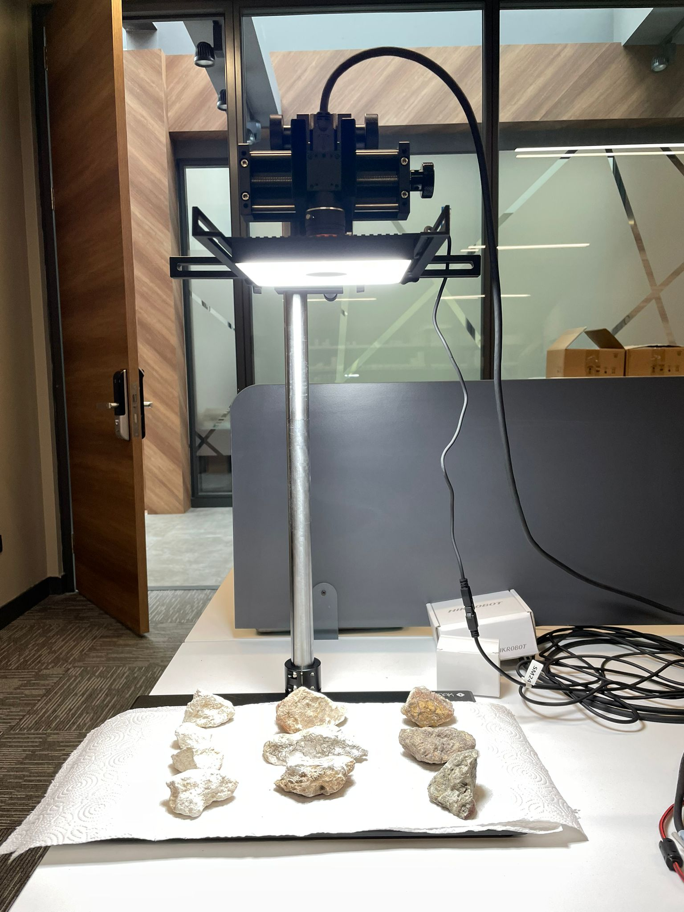
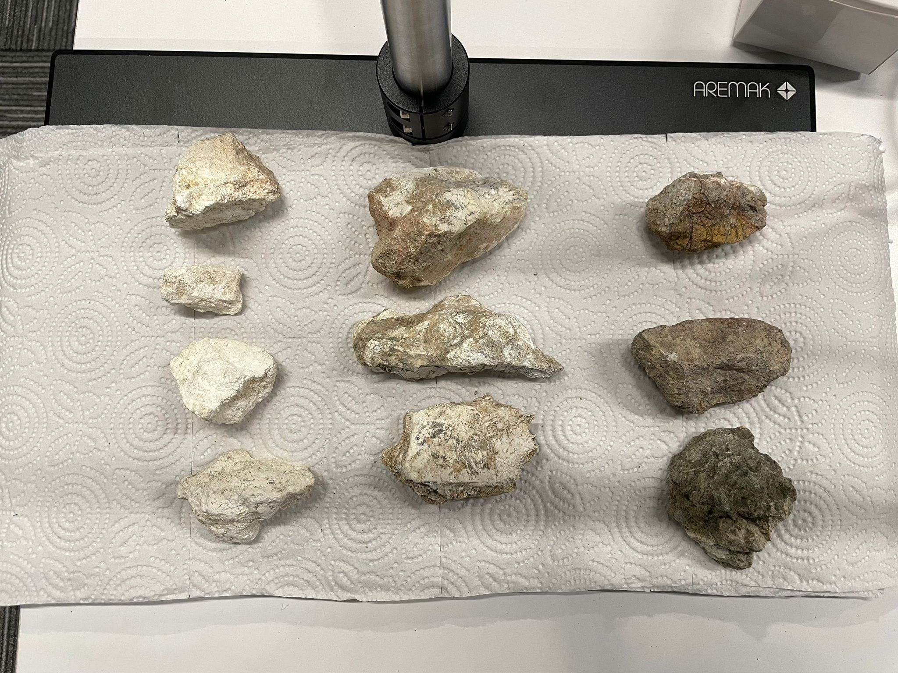

# 📖 Object Classification GUI

## 1️⃣ Project Overview
This project is a GUI-based object classification tool that uses OpenCV and PyQt5. It enables users to load images, extract histogram-based features, and train a classification model. The key objectives include:
- Providing a user-friendly interface for image classification.
- Extracting color histograms in HSV format for feature representation.
- Supporting dataset training and classification tasks.

## 2️⃣ Equipment and Technologies Used

📷 Camera Model: Hikrobot MV-CS060-10UC-PRO
🔬 Lens: MVL-HF0828M-6MPE
🏗 Camera Stand: Aremak Adjustable Machine Vision Test Stand
💡 Lighting: Hikrobot Shadowless Ring Light(MV-LGES-116-W)
🖥️ Operating System: Windows
🔧 Software Tools: Python, OpenCV, Hikrobot SDK, CSV, Pandas, scikit-learn, PyQt5

## 3️⃣ Setup Photos 📸

Image of the camera setup:


Image of the rocks used for training and testing:



## 4️⃣ Installation and Running Instructions 🚀

1. Clone the repository:
   ```sh
   git clone https://github.com/affanahmed2/Object-Classification-GUI.git
   cd Object-Classification-GUI
   ```
2. Install the required dependencies:
   ```sh
   pip install opencv-python numpy pyqt5
   ```
3. Run the application:
   ```sh
   python main.py
   ```

## 5️⃣ Internship Acknowledgment
---
🏢 This project was developed during an internship at [Aremak Bilişim Teknolojileri](https://www.aremak.com.tr) under the supervision of Emrah Bala.

